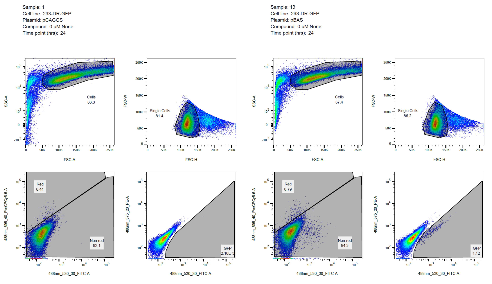

# Reporter Assay To Measure Double Strand Break Repair Pathway Choice
Adapted from [protocol used in Maria Jasin's lab](https://www.ncbi.nlm.nih.gov/pmc/articles/PMC4036680/).

## Transfection And Treatment Of Cells
### Overview
The assay can be set up using either cell lines that have a stably-integrated reporter construct that measures double strand break repair (DSBR) pathway use, or they can be transiently transfected with a plasmid bearing the reporter construct. The cells are transfected with the pCBA_Sce_ plasmid expressing the I-SceI endonuclease, which makes a double strand break (DSB) in the reporter construct; the repair product results in a functional GFP open reading frame if the break is repaired by a specific DSBR pathway. As a control for no DSBs, a sample of cells is transfected with pCAGGS, which lacks the I-SceI open reading frame.

This assay is adapted for testing the effects of compounds on DSBR pathway use. Because DMSO is the vehicle for nearly all compounds that are routinely tested, DMSO is present at a final concentration of 0.5% in all samples. Each assay well contains 2 ml media + DMSO ± compound and 1 ml media + transfected cells for 3 ml total. Many compounds themselves impart fluorescence to the cells during incubation; therefore, it is recommended to include a pCAGGS control with each concentration of each compound to so that gates can be drawn during data analysis that take into account the effects of compound on the fluorescence of the entire cell population.

The transfection parameters and plating densities below are optimized for 293-HEK cells.

### Initial Cell Culture
- Use one or more dishes of subconfluent cells, enough to provide 0.5 - 1.0 x 106 cells per sample. If more than 106 cells per sample are used, they can get clumpy during collection for flow cytometry, making them difficult to analyze.

### Materials, Reagents, And Equipment
- 6-well tissue culture plates
- Plasmids to be used for transfection:
	- pCAGGS, which is an empty vector plasmid that lacks I-SceI and is used as a negative control.
	- pCBA_Sce_, which expresses the I-SceI endonuclease.
	- _Optional_: pHPRT-DRGFP (contains the DR-GFP reporter construct) or other reporter plasmid if the cell line being used does not have a stably-integrated reporter construct.
	- _Optional_: pDsRed-Express2 or similar plasmid that constitutively expresses a fluorescent protein and is used as a control for transfection efficiency.
	- Plasmids are purified from _E. coli_ using a Qiagen GigaPrep kit. Plasmid preps must be free of bacterial DNA and RNA.
- Electroporation cuvettes, 0.4 mm gap width
	- The cuvettes can be cleaned an reused several times.
	- After use:
		- Wash each cuvette in a [glass cuvette washer](https://www.sigmaaldrich.com/catalog/product/aldrich/z202711) using a 1:10 dilution of bleach (0.6% hypochlorite ion).
		- Rinse each cuvette three times in distilled water.
		- Air-dry.
	- Before reuse:
		- Immerse each cuvette and cap for at least 3 minutes in beaker of 70% ethanol.
		- Remove the cuvettes from the beaker and vacuum aspirate the residual ethanol from inside each cuvette and cap. Set the caps aside to air-dry in the TC hood.
		- Wash the cuvettes once by filling each one with sterile water and vacuum-aspirating the wash.
		- Replace the caps and set aside until needed.
- Electroporator
- Opti-MEM medium

### Procedure
1. For each compound, make working stocks of medium + DMSO ± compound by diluting compounds in 100% DMSO to 200X their final concentration and then add complete medium to dilute the compounds to 1.5X their final concentration and the DMSO to 0.75%.
	- If compounds are made up in a vehicle other than DMSO, make the 200X dilutions in that vehicle first and then add medium + 0.75% DMSO, also keeping the vehicle concentration the same across all the samples.
1. Distribute 2 ml of medium + DMSO ± compound into each respective well of the 6-well plates and move to the incubator.
1. Collect cells by trypsinization, spin down, and resuspend in an appropriate volume of Opti-MEM.
	- The resuspension volume is 0.8 ml times the number of cuvettes used plus sufficient dead volume.
	- Separate cuvettes are used for each combination of cells and plasmid to be transfected. Each cuvette should contain 0.5 - 1.0 x 107 cells in 0.8 ml. If more cells are going to be used in a transfection, increase the volume and number of cuvettes accordingly.
1. Distribute cell suspension into polypropylene conical vials and add plasmid DNA.
	- Use one vial for each combination of cells and plasmid to be transfected, with each vial containing 0.8 ml of suspension times the number of cuvettes used for that transfection.
	- Each vial should be sufficiently large to contain the final volume after transfection, which is 1 ml per well for each transfection, plus dead volume.
	- Plasmid DNA is added to each cell suspension to a total combined concentration of 37.5 μg/ml.
1. Distribute 0.8 ml of cell suspensions + plasmid into each respective electroporation cuvette. Add complete medium to the vials originally containing cell suspension + plasmid for each transfection to a final volume of 1 ml per well plus dead volume and minus the expected recovery volume of 0.7 ml per cuvette.
1. Electroporate each cuvette using the following parameters:
	- 325 V
	- 975 μF
	- ∞ Ω
	- 4 mm gap width
	- Time constants should be 15 - 20 ms
1. Transfer the contents of each cuvette back into the original conical vial containing complete medium for each transfection.
1. Distribute 1 ml medium + transfectants into each respective well of the 6-well plates.
1. Distribute the cells evenly in each well by shaking the plates five times along the north-south axis, pausing for a couple seconds, and the shaking five times along the east-west axis. Repeat 7 times.
	- Rotational shaking will cause all the cells to accumulate in the center of the wells.
1. Incubate the plates for the desired amount of time post-transfection, typically 24 - 48 hours.

## Flow Cytometry And Data Analysis
### Materials, Reagents, And Equipment
- Polystyrene 5 ml flow cytometry tubes (Falcon 352008)
- Polypropylene 1 ml micro titer tubes (Genesee 14-144)
- Flow cytometry resuspension buffer:
	- 1X PBS
	- 1 μg/ml 7-AAD
	- _Optional_: ≥250 U/ml Benzonase (Sigma E1014) to prevent clumping caused by cell lysis. **_Always use barrier tips when handling concentrated solutions of Benzonase._**
- Styrofoam box with blue ice packs. The box should be large enough to hold a rack of flow cytometry tubes.
- Flow cytometer equipped with a 488 nm excitation source and FITC (green), PerCP-Cy5.5 (red), and PE (orange) filters.
	- The orange filter is optional but recommended because the GFP+ population is much easier to separate from the rest of the cells on a green-orange plot than a green-red plot.
	- We routinely use a BD LSRII system. The BD Fortessa systems can also be used if the LSRII is down, though these systems as configured lack the recommended PE detection filters.
- Computer with [FlowJo](https://www.flowjo.com/) installed.

### Procedure
1. Remove the media from each well, wash with PBS, and collect cells by trypsinization. Spin down the cells in 1.5-ml tubes and carefully remove the supernatant with a pipette.
	- Be careful not to over-trypsinize the cells, which can cause the samples to become clumpy.
	- For 293-HEK and other poorly-adherent cells, the PBS wash between media removal and trypsinization is omitted.
1. Resuspend the cells in a suitable amount of flow cytometry resuspension buffer.
	- The final volume should result in a cell suspension that produces 1,000 - 5,000 cell events per second on a flow cytometer set to medium flow rate.
	- This is usually 50 μl per sample, more if there are a lot of cells, and as low as 30 μl for samples with few cells.
1. Transfer each sample to a 1 ml micro titer tube nested in a 5 ml flow cytometry tube.
	- Having the samples in micro titer tubes allows very small sample volumes to be analyzed.
1. Move the sample tubes in a rack to the styrofoam box with ice packs, cover, and take the samples to the flow cytometry lab.
	- Samples can be kept at 4 - 8 °C in the dark for up to a few hours.
1. Collect data for each sample on the flow cytometer:
	- Collect data from FSC-A/W/H, SSC-A, FITC-A, PerCP-Cy5.5-A, and PE-A channels.
	- Ensure that the most fluorescent samples can be read in the linear range for each channel.
	- Set up gates for cells (non-debris) on FSC-A vs SSC-A, single cells on FSC-W vs FSC-H, and live (7-AAD negative) cells on FITC-A vs PerCP-Cy5.5-A. Set up a gate for GFP+ cells on FITC-A vs PE-A.
	- Collect at least 10,000 live single cells from each sample, preferably 30,000 to 50,000 live single cells. This should be enough to give at least a hundred GFP+ events in the positive control.
1. Analyze the data in FlowJo, create a table containing the number of total, non-debris, single cell, live cell, and GFP+ events for each sample, and create a batch layout where each page contains flow cytometry plots for a single sample.
	- Use the pCAGGS negative control to draw gates on the FITC vs PerCP-Cy5.5 and FITC vs PE plots. Apply these gates to the rest of the samples.
	- If compounds that impart fluorescence to cells are being tested, pCAGGS controls should have been set up for each dose of each compound. Set up gates as above for each dose of each compound and apply them to the rest of the samples having the same dose of the same compound.
	- Shown below is an example of gating done on the pCAGGS control, which is copied to the pBAS_Sce_ sample. _Note that the FSC-H and FSC-W axis labels are switched for some reason when obtaining data on the LSRII and analyzing in FlowJo_.
